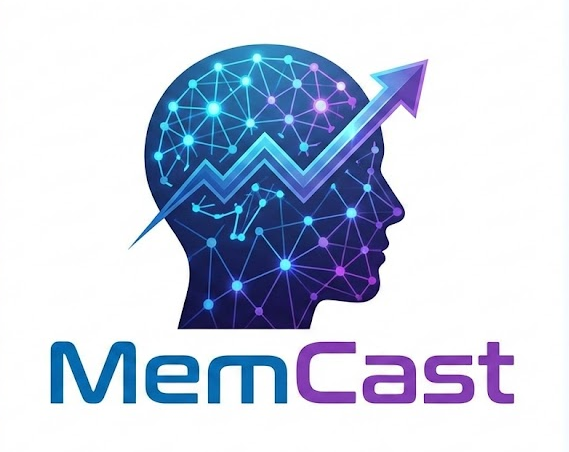
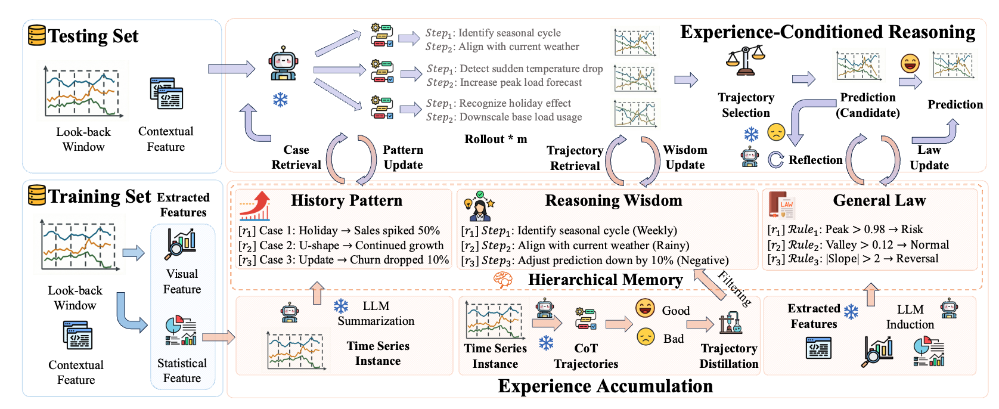
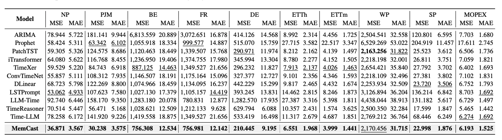
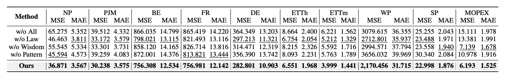
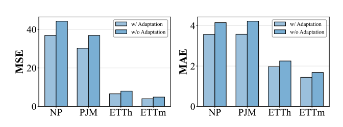
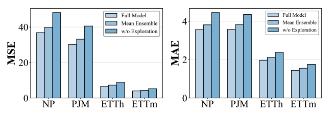

<div align="center">
  <h1>MemCast: Memory-Driven Time Series Forecasting with Experience-Conditioned Reasoning</h1> 
  <a href="./LICENSE">
    
  </a>
  <a href="https://github.com/Xiaoyu-Tao/MemCast-TS/stargazers">
    
  </a>
  <a href="https://github.com/Xiaoyu-Tao/MemCast-TS/pulls">
    
  </a>

</div>

---

MemCast is a novel framework that reformulates **Time Series Forecasting (TSF)** as an **experience-conditioned reasoning task**. It explicitly accumulates forecasting experience into a hierarchical memory and leverages it to guide the inference process of Large Language Models (LLMs).

> 📝 “MemCast: Memory-Driven Time Series Forecasting with Experience-Conditioned Reasoning”  
> **Preprint** | [📄 Paper]()

---

## 🔍 Overview

Existing LLM-based forecasting methods often treat instances as isolated reasoning tasks, lacking explicit experience accumulation and continual evolution. MemCast introduces a new learning-to-memory paradigm:

- **Experience Accumulation**: Organizes training data into a **Hierarchical Memory** consisting of historical patterns, reasoning wisdom, and general laws.
- **Experience-Conditioned Reasoning**: Retrieves relevant patterns to guide reasoning, utilizes wisdom for trajectory selection, and applies general laws for reflective iteration.
- **Continual Evolution**: Enables dynamic confidence adaptation to update memory entry confidence during inference without test data leakage.

<p align="center">
  
</p>

---

## ✨ Key Features

-  ✅ **Hierarchical Memory**: Structured storage of trend summaries, reasoning trajectories, and physical constraints.
-   🔗 **Wisdom-Driven Exploration**: Samples multiple reasoning paths and selects the optimal trajectory based on semantic consistency.
-   🔄 **Rule-Based Reflection**: Iterative refinement mechanism that enforces domain-specific constraints (e.g., non-negativity).
-   📊 **Dynamic Adaptation**: A confidence adaptation strategy that allows the model to evolve continuously in non-stationary environments.
-   🏆 **SOTA Performance**: Consistently outperforms deep learning and LLM-based baselines on Energy, Electricity, and Weather benchmarks.

---

## 🚀 Getting Started

### 1. Clone the repo

```bash
git clone https://github.com/Xiaoyu-Tao/MemCast-TS
cd MemCast
```

### 2. Environment Setup

```bash
conda create -n memcast python=3.10
conda activate memcast
pip install -r requirements.txt
```

### 3. Prepare Data
MemCast is evaluated on diverse real-world datasets with rich contextual features:
Energy (NP, PJM, BE, FR, DE) 
Electricity (ETTh1, ETTm1) 
Renewable Power (Windy Power, Sunny Power) 
Hydrology (MOPEX) 
First, the training and evaluation datasets used in our experiments can be found in [Google Drive](https://drive.google.com/file/d/1HOCE20FQgLl0xCv_dOmLcTbN1RCZWwqd/view?usp=drive_link).
Please place the datasets in the dataset directory.

```bash
mkdir dataset
# Download datasets to ./dataset/
```

### 4. Experience Accumulation (Memory Construction)
```
sh scripts/accumulation/build_memory.sh
```

### 5. Short-term Forecasting (e.g., NP)
```
sh scripts/short_term/NP.sh
```
### 6. Long-term Forecasting (e.g., ETTh)
```
sh scripts/long_term/ETTh.sh
```
## 📊 Benchmark Results
**Full Results:**

Overall Performance: MemCast consistently achieves the best or second-best results across datasets, surpassing Time-LLM and TimeReasoner.

**Ablation Results:**


<p align="center">
  
  &emsp;
  
</p>
Ablation Study: Validation of memory components and dynamic adaptation strategy.